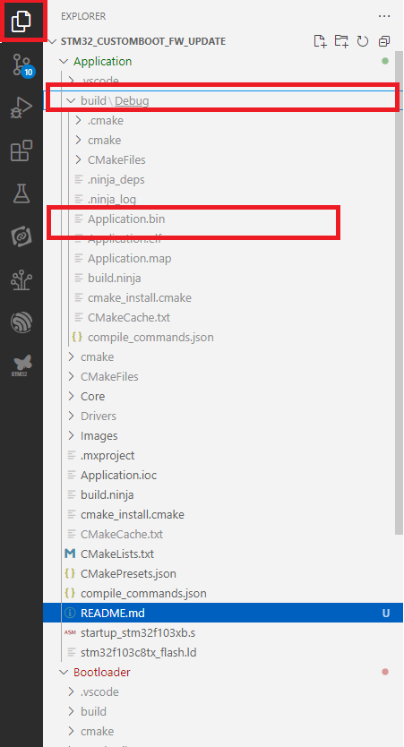

**Overview**

Before importing and building, it is necessary to reconfigure the application’s address, size, and the vector table address. In this case, my main application only has basic functionality, such as blinking the LED on PC13 and printing logs through UART2.

**Modify CMakeLists.txt to generate bin file**

Add this code in end of file:

```cmake
add_custom_command(TARGET ${PROJECT_NAME} POST_BUILD
    COMMAND ${CMAKE_OBJCOPY} -O binary $<TARGET_FILE:${PROJECT_NAME}> ${PROJECT_NAME}.bin
    COMMENT "Generating ${PROJECT_NAME}.bin"
)
```

**Build**

Follow build bootloader guide in bootloader README file

**Output**

<p align="center" style="margin-left:0em;">

</p>