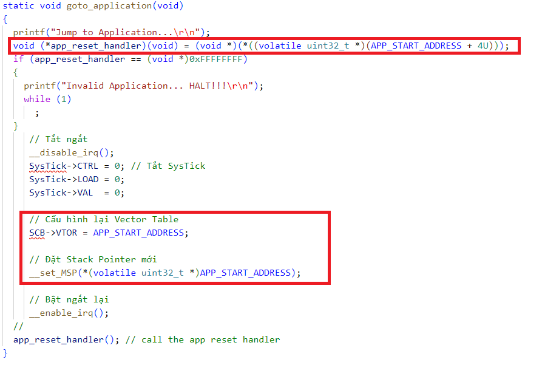
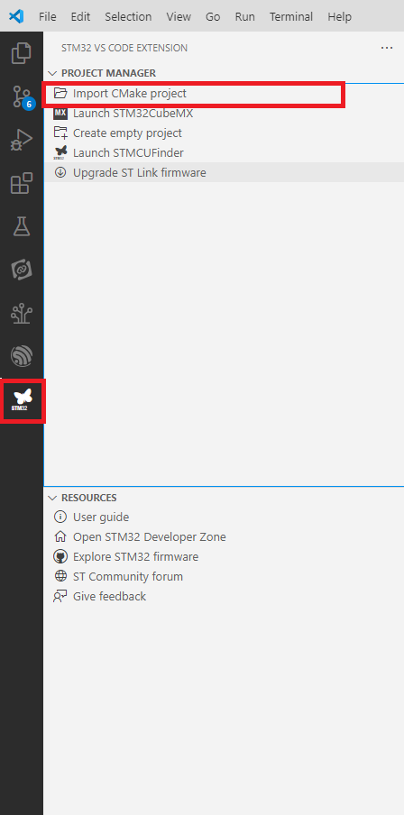
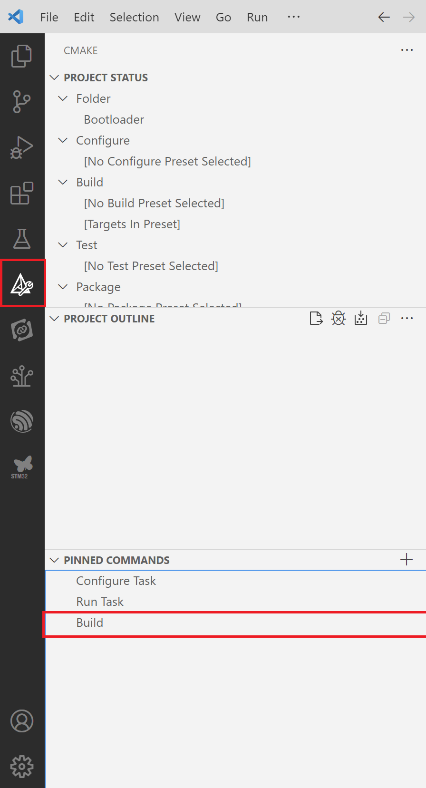
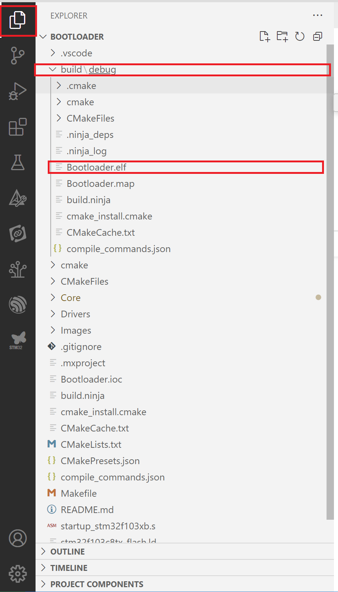

**Overview**

The bootloader will check if a firmware update is needed before transitioning to the main application. The bootloader is called every time the system is reset. In this project, I will allocate the bootloader starting at address 0x8000000 with a size of 20K. Therefore, the first step is to configure the bootloader memory region.

**Set flash partition for bootloader**

I allocate flash for bootloader region 20K (0x5000), so Application will start from 0x8005000, I need to set   application addreess

Open file stm32f103c8tx_flash.ld and set 

FLASH (rx)      : ORIGIN = 0x8000000, LENGTH = 20K

Open Core/Inc/app_config.h and set corressponding App addreess

#define APP_START_ADDRESS 0x8005000

In goto_app function we need to set Main stack pointer, Vertor Table address then Jumpto Application reset handler function  

**Import Project**

**Build Project**

**Output File**

